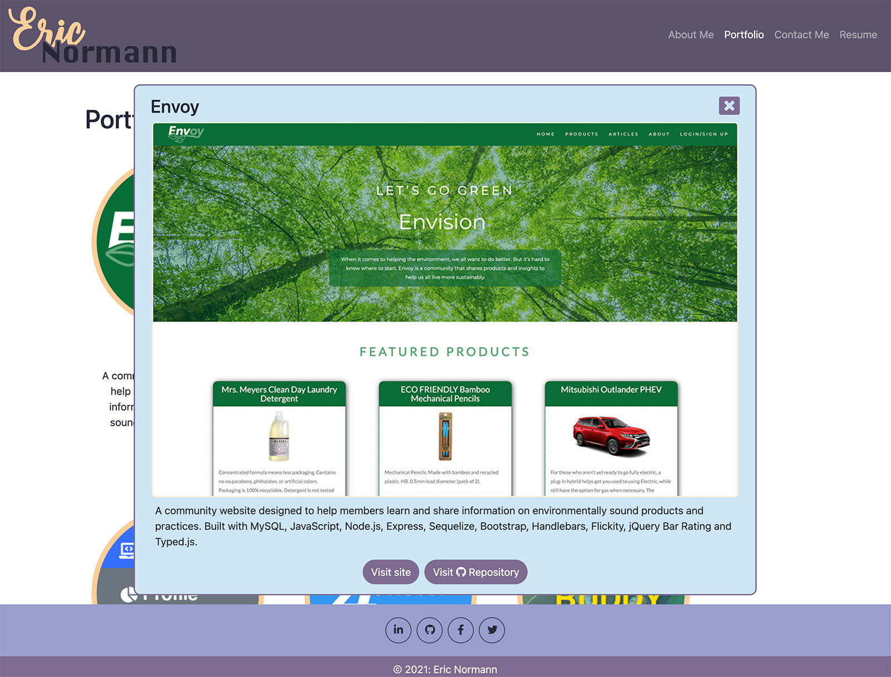

# Portfolio

## Table of Contents
* [Description](#description)
* [Tools](#tools)
* [Instructions](#instructions)
* [Developer](#developer)
  
## Description
A portfolio website, featuring my web development work, built as a single page application, using React.

## Tools
Built with React, Bootstrap and Sass.

## Instructions
1. Visit the site at https://e-p-n.github.io.
2. Navigate through the About Me, Portfolio, Contact Me and Resume sections of the site.
3. Contact form can be filled out, but is not cirrently set up to send any data.

## Developer
This website was developed by Eric Normann, a student in the full-stack development program at U of T. If you have questions, please visit my [GitHub](http://github.com/e-p-n) page or [email](mailto:eric.n@me.com?subject=Question%20regarding%20Portfolio) me.
  
